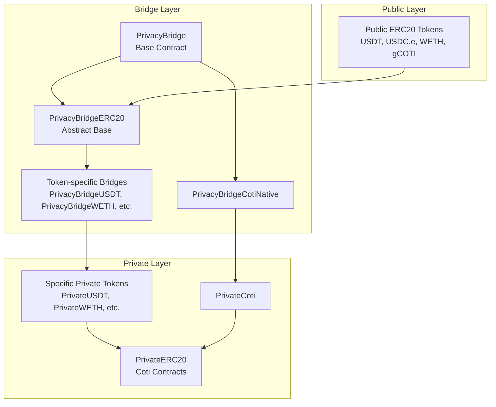
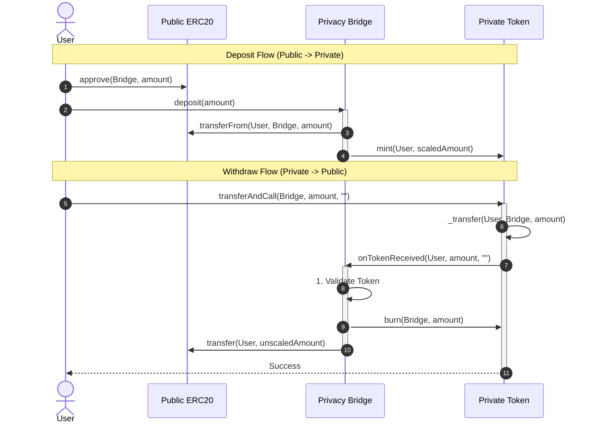

# COTI Privacy Bridge Contracts

[](https://soliditylang.org)
[](https://hardhat.org)
[](https://openzeppelin.com)
[](test/mythril_security_report.md)

Smart contracts for the COTI Privacy Bridge, enabling seamless bridging between public ERC20 tokens and private, encrypted tokens on the COTI L2 network.

---

## 📖 Table of Contents

- [Architecture](#-architecture)
- [Deployed Contracts](#-deployed-contracts)
- [Project Structure](#-project-structure)
- [Setup and Deployment](#-setup-and-deployment)
- [Testing and Security](#-testing-and-security)


---

## 🏗 Architecture

The system consists of three main components:

1.  **Public ERC20 Tokens (`contracts/erc20-mocks/`)**
    -   Standard ERC20 tokens representing assets on the COTI network (e.g., WETH, USDC.e, USDT).
    -   In a production environment, these are the existing canonical tokens. For development, mocks are provided.

2.  **Private Encrypted Tokens (`contracts/privateERC20/tokens/`)**
    -   Privacy-preserving tokens built on `PrivateERC20` (implementing `IPrivateERC20`).
    -   **Full uint256 Support**: Tokens use 256-bit encrypted integers (replacing legacy 64-bit), allowing 1:1 mapping with public tokens (18 decimals).
    -   **Strict Transfer Verification**: `transferAndCall` enforces strict verification of the encrypted transfer success status.

3.  **Privacy Bridges (`contracts/privateERC20/privacyBridge/`)**
    -   The bridge contracts manage the conversion between Public and Private tokens.
    -   **Deposit**: User locks/transfers Public tokens to the bridge -> Bridge mints equivalent Private tokens to the user.
    -   **Withdrawal**: User initiates withdrawal of Private tokens -> Bridge burns Private tokens -> Bridge unlocks/transfers Public tokens back to the user.
    -   **PrivacyBridgeCotiNative**: Specialized bridge for native COTI coins.
    -   **PrivacyBridgeERC20**: Abstract bridge for ERC20 tokens, using abstract hooks (`_mintPrivateToken` / `_burnPrivateToken`) that derived contracts implement using concrete token types.

### Contract Hierarchy



### Sequence Diagram: Deposit & Withdraw



### �🔄 The Transfer-and-Call Pattern (Withdrawal)

To avoid the need for encrypted approvals (which are problematic with **COTI SNAP**), the system uses an **Atomic Push Pattern** for withdrawals.

#### Why not use `approve`?
The standard `approve` function on Private Tokens requires an encrypted input (`itUint64`), which implies a signature. Generating this signature when using **COTI SNAP** is problematic because:

1.  **MetaMask Limitation (EIP-191)**: Browser wallets enforce EIP-191 prefixing (`\x19Ethereum Signed Message...`) on all signatures (`personal_sign`). `eth_sign` (raw signing) is deprecated/disabled for security.
2.  **Snap Limitation**: Evaluation of the `coti-snap` source code (at `examples/packages/snap/src/index.tsx`) confirms that it **does not expose a custom signing RPC method**. It only handles `encrypt`, `decrypt`, and key management (`get-aes-key`).
3.  **The Conflict**: without a custom signing method in the Snap, the dApp must use the standard wallet signer. The forced EIP-191 prefix causes signature validation failures in the MPC contract, which requires a specific signature format (often raw or differently structured) for `itUint` inputs.

**Problematic Code Interface:**
```solidity
struct itUint64 {
    uint256 ciphertext;
    bytes signature; // <--- The problematic field
}

// PrivateERC20.sol
function approve(address spender, itUint64 calldata amount) public virtual returns (bool);
```

#### Alternative: Enabling `eth_sign` (Advanced/Unsafe)
It is technically possible to make `approve` work if the user manually enables **"Eth Sign"** in MetaMask settings (if available) or uses a wallet that supports raw signing.
*   **How**: Settings -> Advanced -> Toggle "Eth Sign" (varies by version).
*   **Why we don't use it**: It is highly insecure (allows signing arbitrary transactions/data) and presents a scary warning to the user. `transferAndCall` provides a secure, user-friendly alternative without requiring dangerous settings modifications.

By using `transferAndCall`, we send a **plaintext** `uint64` amount. The contract handles the conversion to encrypted state internally, removing the need for a client-side signature entirely.

#### How it works:
1.  **User** calls `privateToken.transferAndCall(bridgeAddress, amount, data)`.
2.  **PrivateToken** transfers the tokens to the Bridge.
3.  **PrivateToken** calls `ITokenReceiver(bridgeAddress).onTokenReceived(...)`.
4.  **Bridge** verifies the call, burns the private tokens, and sends the equivalent public tokens to the user.

This flow is defined by the `ITokenReceiver` interface:

```solidity
interface ITokenReceiver {
    function onTokenReceived(address from, uint64 amount, bytes calldata data) external returns (bool);
}
```

### ⚠️ Important: Direct Transfers

**Native COTI vs. ERC20 Differences**

*   **Native COTI (`PrivacyBridgeCotiNative`)**:
    *   **Direct Transfers Supported**: You **CAN** send native COTI directly to the bridge contract address.
    *   **Mechanism**: The contract implements a `receive()` fallback function that treats any direct value transfer as a deposit.
    *   **Result**: The bridge will automatically mint the equivalent `PrivateCoti` to the sender.

*   **ERC20 Tokens (`PrivacyBridgeERC20`)**:
    *   **Direct Transfers NOT Supported**: You **CANNOT** send ERC20 tokens directly via standard `transfer()`. They will be lost.
    *   **Withdrawal Method**: You **MUST** use `transferAndCall` for Private Tokens.
        1.  **Call**: `privateToken.transferAndCall(bridgeAddress, amount, "0x")`.
        2.  **Result**: The bridge receives the callback and processes the withdrawal immediately.
        3.  *Note: The old `approve` + `withdraw` flow is deprecated.*

---

## 📋 Deployed Contracts

### COTI Mainnet (Chain ID: `2632500`)

| Contract                    | Address                                      | Type          |
| --------------------------- | -------------------------------------------- | ------------- |
| **PrivacyBridgeCotiNative** | `0x6056bFE6776df4bEa7235A19f6D672089b4cdBeB` | Native Bridge |
| **PrivateCoti**             | `0x143705349957A236d74e0aDb5673F880fEDB101f` | Private Token |
| **WETH**                    | `0x639aCc80569c5FC83c6FBf2319A6Cc38bBfe26d1` | Public Token  |
| **WBTC**                    | `0x8C39B1fD0e6260fdf20652Fc436d25026832bfEA` | Public Token  |
| **USDT**                    | `0xfA6f73446b17A97a56e464256DA54AD43c2Cbc3E` | Public Token  |
| **USDC.e**                  | `0xf1Feebc4376c68B7003450ae66343Ae59AB37D3C` | Public Token  |
| **gCOTI**                   | `0x7637C7838EC4Ec6b85080F28A678F8E234bB83D1` | Public Token  |

### COTI Testnet (Chain ID: `7082400`)

| Contract                    | Address                                      | Type          |
| --------------------------- | -------------------------------------------- | ------------- |
| **PrivacyBridgeCotiNative** | `0x1B64d8CbD261538f3fc614FF1A67B24A4a31E195` | Native Bridge |
| **PrivateCoti**             | `0x6107a3CA7eb1b231aF1a9CD07F452F56A65a30f2` | Private Token |
| **PrivacyBridgeWETH**       | `0xa8F24B3dCB8c8565BBa405cBAAbB9b14A5382B0c` | ERC20 Bridge  |
| **PrivacyBridgeWBTC**       | `0x3C2F3ca101903Cb824430a526b2de92a90CdF85b` | ERC20 Bridge  |
| **PrivacyBridgeUSDT**       | `0x655f1Aaa4050f957959a3E0e759bB01cCca38e49` | ERC20 Bridge  |
| **PrivacyBridgeUSDCe**      | `0x64972812c2E82b380024B19056df669C1D0CBeCC` | ERC20 Bridge  |
| **PrivacyBridgeWADA**       | `0x35a0D2046770dE406350871a2Eb2ed5880601Cd5` | ERC20 Bridge  |
| **PrivacyBridgegCOTI**      | `0xFE0090C0051D0D2740cc6A987ab9f5aC6E3fA59c` | ERC20 Bridge  |

> 📋 **Full contract addresses**: See [`src/contracts/config.ts`](../src/contracts/config.ts)

---

## 📁 📁 Project Structure

```
contracts/
├── erc20-mocks/           # Public ERC20 mock tokens for testing
│   ├── WETH.sol
│   ├── WBTC.sol
│   ├── USDT.sol
│   ├── USDC.e.sol
│   ├── WADA.sol
│   └── gCoti.sol
├── privateERC20/          # Private encrypted token implementations
│   ├── PrivateERC20.sol   # Base abstract contract (256-bit)
│   ├── IPrivateERC20.sol  # Interface
│   ├── tokens/            # Specific Private Tokens
│   │   ├── PrivateCoti.sol
│   │   ├── PrivateWETH.sol
│   │   ├── PrivateBTC.sol
│   │   ├── PrivateUSDT.sol
│   │   ├── PrivateUSDC.e.sol
│   │   ├── PrivateWADA.sol
│   │   └── PrivategCoti.sol
│   └── privacyBridge/     # Bridge logic contracts
│       ├── PrivacyBridge.sol         # Base contract
│       ├── PrivacyBridgeCotiNative.sol  # Native COTI bridge
│       ├── PrivacyBridgeERC20.sol    # Abstract ERC20 bridge
│       ├── PrivacyBridgeWETH.sol
│       ├── PrivacyBridgeWBTC.sol
│       ├── PrivacyBridgeUSDT.sol
│       ├── PrivacyBridgeUSDCe.sol
│       ├── PrivacyBridgeWADA.sol
│       └── PrivacyBridgegCoti.sol
├── scripts/               # Deployment and utility scripts
│   ├── deploy_tokens_and_bridges.cjs
│   └── ...various utility scripts
└── test/                  # Test files and reports
    ├── mythril_security_report.md
    └── test_execution.md
```

---

## ⚙️ ⚙️ Setup and Deployment

### 1. Prerequisites
**Important:** All commands listed below must be executed from the **project root directory** (the folder containing `package.json` and `hardhat.config.cjs`), NOT from within the `contracts/` directory.

Ensure you have the dependencies installed:
```bash
# Run from project root
npm install
```

### 2. Configuration
Create a `.env` file in the **project root** (or `contracts/.env` if you configure your environment loader path) with your private key.

**Required Variable:**
```env
PRIVATE_KEY=your_private_key_here
```

### 3. Compilation
Compile the smart contracts using Hardhat (from project root):
```bash
npx hardhat compile
```

### 4. Deployment on COTI Testnet
To deploy the tokens and bridges to the COTI Testnet, run the deployment script (from project root):

```bash
npx hardhat run contracts/scripts/deploy_tokens_and_bridges.cjs --network cotiTestnet
```

This script will:
1.  Deploy public mock tokens (if configured).
2.  Deploy private tokens.
3.  Deploy bridge contracts.
4.  Grant the necessary `BRIDGE_ROLE` to the bridge contracts, authorizing them to mint/burn private tokens.

## 🧪 Testing and Security

### Running Tests

```bash
# Run all tests
npx hardhat test

# Run specific test file
npx hardhat test test/PrivacyBridge.test.js

# Run with gas reporting
HARDHAT_GAS_REPORTER=true npx hardhat test

# Run with coverage
npx hardhat coverage
```

### Security Analysis

All bridge contracts have been analyzed using [Mythril](https://github.com/ConsenSys/mythril) for common vulnerabilities:

| Contract                      | Status   | Issues |
| ----------------------------- | -------- | ------ |
| `PrivacyBridgeCotiNative.sol` | ✅ Passed | 0      |
| `PrivacyBridgeUSDT.sol`       | ✅ Passed | 0      |

### Reports

| Report                                                     | Description                      |
| ---------------------------------------------------------- | -------------------------------- |
| [Mythril Security Report](test/mythril_security_report.md) | Automated vulnerability analysis |
| [Test Execution Logs](test/test_execution.md)              | Detailed test output and results |

---


## 📚 Additional Resources

- [COTI Documentation](https://docs.coti.io)
- [OpenZeppelin Contracts](https://docs.openzeppelin.com/contracts)
- [Hardhat Documentation](https://hardhat.org/docs)

---

<p align="center">
  <a href="../README.md">← Back to Main README</a>
</p>
